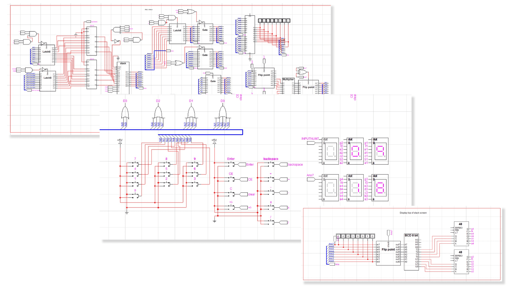

# Calculator Circuit

Calculator circuit project is a pair term project in Computer System course which use all knowledge about binary, boolean algebra, logical gate and circuit. In this project, we have to create postfix calculator which use stack in order to implement the calculator. Postfix concept is different from prefix that people typically use in real life when calculate the number. Postfix use stack to calculate the number such as if we want to find out what is the result of 8 x 6, we have to put 8 and 6 into the stack and then use operation x (multiply) in order to pop 8 and 6. After that, we then calculate multiplication of 8 and 6, and push the result 46 in the stack. 

## Tool 🛠
- LogicWorks 5 - leading schematic drawing and interactive digital simulation program for demonstrating logic design principles.

## Functions ⚙
- number 0-9 button
- add, subtract, multiply, divide 
- CE (clear entry)
- C (clear all)
- backspace
- +/- (plus / minus button)
- Enter (push number into the stack)

## What knowledge do we need in order to create this project? 
- Digital System and Binary Numbers 
  - how computers keep data in their memory
  - how to convert between binary and decimal
  - complement of numbers
  - most significant bit and least significant bit
  - gray code
  - ASCII character code
  - unicode
- Boolean Algebra
- Transistor and Logic Gates
  - AND, OR, Invertor, Buffer, NAND, NOT, XOR, NOR
  - MUX, Decoder, Full adder, Half adder
  - RAM
- Gate-level minimization 
  - Karnaugh Map (K-map)
- Electronics 
  - clock
  - volt
  - binary probe
  - binary switch
  - GND
  - Shift
  - 7-Segment
